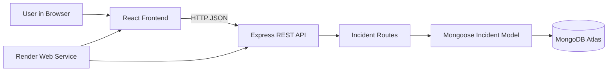
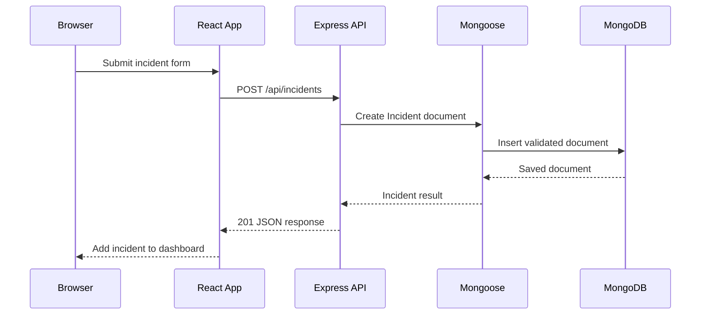
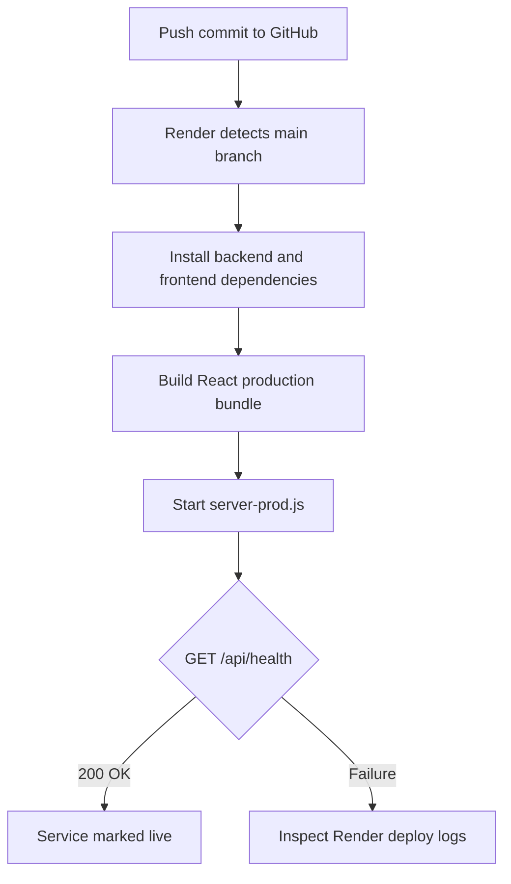

# CortexOps Incident Management System

CortexOps is a full-stack incident management system for reporting, tracking, updating, and resolving operational incidents. It demonstrates a practical MERN-style application with a React client, an Express REST API, and MongoDB persistence.

## What The Project Does

Users can create incidents with a title, description, and severity, then monitor the incident queue, update status, edit details, or remove incidents. The application is intentionally small enough to understand quickly while still showing the complete path from browser interaction to database persistence.

## Features

- Create incidents with `Low`, `Medium`, or `High` severity
- View incidents sorted newest first
- Update title, description, severity, and status
- Track `Open`, `In Progress`, and `Resolved` states
- Delete incidents
- Responsive React interface
- MongoDB Atlas persistence through Mongoose
- REST API with JSON responses
- Production server that serves both the API and built React app
- Health endpoint for Render or other hosting platforms
- Automated CRUD integration tests using an isolated in-memory MongoDB

## Technology Stack

| Layer | Technology | Role |
| --- | --- | --- |
| UI | React 19, React Hooks, CSS | Dashboard and incident workflows |
| API | Node.js, Express 5 | HTTP routes and request handling |
| Database | MongoDB, Mongoose | Incident persistence and schema validation |
| Testing | Node test runner, Supertest, MongoDB Memory Server | API and lifecycle verification |
| Deployment | Render, Docker, GitHub | Production hosting and delivery |

## Architecture



The production process runs `backend/server-prod.js`. It mounts the incident API under `/api/incidents`, serves the compiled files from `frontend/build`, and sends browser routes to the React entry page.

## Request Flow



## Data Model

```text
Incident
├── _id: MongoDB ObjectId
├── title: required string
├── description: optional string
├── severity: Low | Medium | High
├── status: Open | In Progress | Resolved
└── createdAt: date
```

## API Reference

Base URL: `/api`

| Method | Endpoint | Description |
| --- | --- | --- |
| `GET` | `/health` | Service health check |
| `GET` | `/incidents` | List all incidents, newest first |
| `POST` | `/incidents` | Create an incident |
| `GET` | `/incidents/:id` | Fetch one incident |
| `PUT` | `/incidents/:id` | Update an incident |
| `DELETE` | `/incidents/:id` | Delete an incident |

Example create request:

```json
{
  "title": "Database connection failure",
  "description": "The primary database is unavailable.",
  "severity": "High"
}
```

New incidents default to `Open`. Mongoose validates severity and status values before writing to MongoDB.

## Project Structure

```text
cortexops/
├── backend/
│   ├── config/db.js                 # MongoDB connection
│   ├── model/Incident.js            # Incident schema and validation
│   ├── routes/incidentRoutes.js     # CRUD API routes
│   ├── test/incidentRoutes.test.js  # Integration tests
│   ├── server.js                    # Local API server
│   └── server-prod.js               # Production API + static server
├── frontend/
│   ├── public/index.html            # Browser metadata and title
│   └── src/
│       ├── App.js                   # Dashboard state and workflows
│       └── App.css                  # Interface styling
├── Dockerfile                       # Production container
├── docker-compose.prod.yml          # Container runtime definition
├── render.yaml                      # Render Blueprint
├── package.json                     # Root commands
└── DEPLOYMENT.md                    # Deployment reference
```

## Run Locally

Prerequisites: Node.js 18 or newer and a MongoDB connection string.

```powershell
cd C:\Users\kp494\OneDrive\Desktop\cortexops
npm run install:all
```

Create `backend/.env`:

```env
MONGO_URI=your-mongodb-connection-string
```

Start the API:

```powershell
npm start
```

Start the React development server in another terminal:

```powershell
npm --prefix frontend start
```

The API runs on `http://localhost:5000`; the React development server normally runs on `http://localhost:3000`.

## Testing And Quality Checks

Run the backend integration tests:

```powershell
npm --prefix backend test
```

Run the production frontend build:

```powershell
npm run build
```

Run syntax checks:

```powershell
node --check backend/server.js
node --check backend/server-prod.js
node --check backend/config/db.js
```

The test suite creates a temporary MongoDB instance, exercises the complete create/list/get/update/delete lifecycle, verifies missing-resource behavior, and confirms invalid severity values are rejected. It does not modify MongoDB Atlas data.

## Production Deployment

The repository includes a Render Blueprint in `render.yaml`.

1. Open Render and choose **New + -> Blueprint**.
2. Select `kuldeeppatil2911/cortexops` on branch `main`.
3. Set the secret `MONGO_URI` environment variable in Render.
4. Apply the Blueprint.

Render runs:

```text
Build: npm install --prefix backend --omit=dev && npm install --prefix frontend && npm run build --prefix frontend
Start: npm run start:production
Health: /api/health
```

The live deployment is currently available at:

https://cortexops-1.onrender.com

## Deployment Flow



## Environment Variables

| Variable | Required | Purpose |
| --- | --- | --- |
| `MONGO_URI` | Yes | MongoDB connection string |
| `PORT` | Render assigns | HTTP listening port |
| `REACT_APP_API_BASE_URL` | No | Optional separate API origin; same-origin is the production default |

Never commit `backend/.env` or expose database credentials in client-side code.

## Future Improvements

- Authentication and role-based access control
- Incident assignment and team ownership
- Audit history and comments
- Search, filters, pagination, and dashboard metrics
- WebSocket notifications for live updates
- Automated CI checks and coverage reporting

## Repository

https://github.com/kuldeeppatil2911/cortexops
